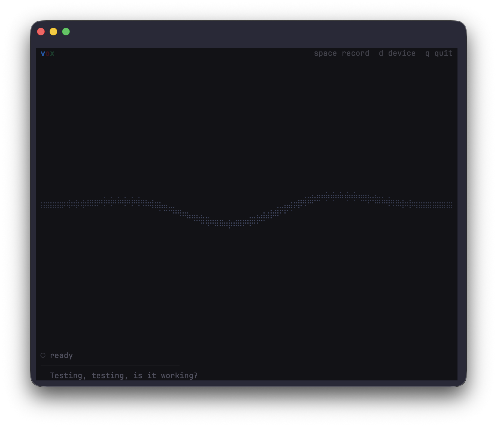

# vox

Beautiful voice-to-text transcription TUI, powered by OpenAI's `gpt-4o-mini-transcribe`.


<!-- Replace with an actual screenshot once captured -->

## What it does

Press **Space** to record from your microphone. Press **Space** again to stop. Your speech is transcribed and displayed in the terminal. That's it.

The UI features a Lark-inspired animated waveform visualization with three layered sine waves (blue, pink, green) that react to your voice in real time.

## Install

Requires Rust and the ALSA development library on Linux:

```bash
# Linux (Debian/Ubuntu)
sudo apt install libasound2-dev

# Build and install
cargo install --path .
```

## Authentication

vox resolves your API key in this order:

| Priority | Source |
|----------|--------|
| 1 | `--api-key` flag |
| 2 | `CODEX_API_KEY` env var |
| 3 | `OPENAI_API_KEY` env var |
| 4 | `~/.codex/auth.json` (written by `codex login`) |

If you've already authenticated with [Codex](https://github.com/openai/codex), vox picks up your credentials automatically.

## Usage

```bash
# Launch the TUI
vox

# Auto-copy each transcription to clipboard
vox --clipboard

# Provide context for better accuracy
vox --context "standup meeting about the billing microservice"

# Use a custom API endpoint
vox --api-base https://your-proxy.example.com/v1
```

### Keyboard shortcuts

| Key | Action |
|-----|--------|
| `Space` | Start / stop recording, or start a new recording after a result |
| `C` | Copy the latest transcription to clipboard |
| `Q` / `Ctrl-C` | Quit |

### Piping output

All transcriptions are printed to stdout when you quit, so you can pipe them:

```bash
vox > notes.txt
```

## Options

```
      --api-key <API_KEY>            OpenAI API key
      --api-base <API_BASE>          API base URL [env: OPENAI_BASE_URL]
      --organization <ORGANIZATION>  Organization ID [env: OPENAI_ORGANIZATION]
      --project <PROJECT>            Project ID [env: OPENAI_PROJECT]
  -c, --clipboard                    Auto-copy transcriptions to clipboard
      --context <CONTEXT>            Context prompt for better transcription accuracy
  -h, --help                         Print help
```

## How it works

vox uses the same voice pipeline as [OpenAI Codex](https://github.com/openai/codex):

1. **Capture** audio from the default microphone via `cpal`
2. **Resample** to 24 kHz mono PCM
3. **Encode** as WAV with peak normalization (0.9x headroom)
4. **Transcribe** via `POST /v1/audio/transcriptions` using the `gpt-4o-mini-transcribe` model

The TUI is built with `ratatui` and renders at 30 fps. The waveform uses three composite sine waves with secondary harmonics, Hanning edge tapering, and an envelope follower that tracks microphone peaks to drive the animation energy.

## Project structure

```
src/
  main.rs        CLI args, auth resolution, app loop
  app.rs         Application state
  ui.rs          Ratatui rendering (header, waveform, status, history)
  waveform.rs    Multi-layered sine wave widget
  audio.rs       cpal capture, PCM resampling, WAV encoding
  transcribe.rs  OpenAI transcription API client
```

## License

MIT
